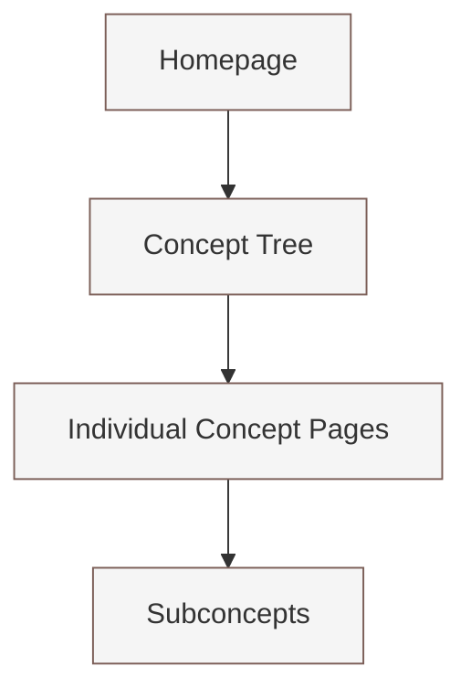

# Buddhist Concepts from Nikaya

View live at: 
- https://hocthayminhtue.pages.dev/
- https://hocthayminhtue.vercel.app/


## Project Overview



## Features

- Tree-based navigation of Buddhist concepts
- Responsive design with mobile-friendly navigation
- Markdown content with Tailwind Typography
- Breadcrumb navigation
- Related concepts display

## Project Structure

```
buddhist-concepts/
├── .eleventy.js           # 11ty configuration
├── package.json           # Project dependencies
├── src/                   # Source files
│   ├── _data/             # Data files
│   │   └── concepts.js    # Concepts tree structure
│   ├── _includes/         # Templates
│   │   ├── layouts/       # Page layouts
│   │   └── partials/      # Reusable components
│   ├── content/           # Markdown content files
│   ├── css/              # Stylesheets
│   ├── js/               # JavaScript
│   └── index.njk         # Homepage
└── _site/                # Generated site (after build)
```

## Getting Started

1. Clone the repository
2. Install dependencies:
   ```bash
   npm install
   ```
3. Run development server:
   ```bash
   npm start
   ```
4. Open browser at http://localhost:8080

## Adding New Concepts

1. Add the concept to the tree structure in `src/_data/concepts.js`:
   ```javascript
   {
     id: "concept-id",
     label: "Concept Name",
     content: "concept-content-file",
     children: [] // Optional subconcepts
   }
   ```

2. Create a markdown file in `src/content/` with the same name as the content property:
   ```markdown
   # Concept Title

   Concept description...

   ## Subtopics

   Additional content...
   ```

## Technologies Used

- [11ty](https://www.11ty.dev/) - Static Site Generator
- [Tailwind CSS](https://tailwindcss.com/) - Utility-first CSS framework
- [Tailwind Typography](https://tailwindcss.com/docs/typography-plugin) - Beautiful typography defaults
- Nunjucks templating

## Development

- CSS is processed using PostCSS with Tailwind
- JavaScript is kept minimal and vanilla for simplicity
- Content is written in Markdown for easy maintenance

## Building for Production

```bash
npm run build
```

This will:
1. Compile Tailwind CSS for production
2. Build the site with 11ty
3. Output to the `_site` directory

## Contributing

1. Fork the repository
2. Create your feature branch
3. Add or modify content/features
4. Submit a pull request

## License

This project is available under the MIT license. Feel free to use, modify, and distribute as needed.
